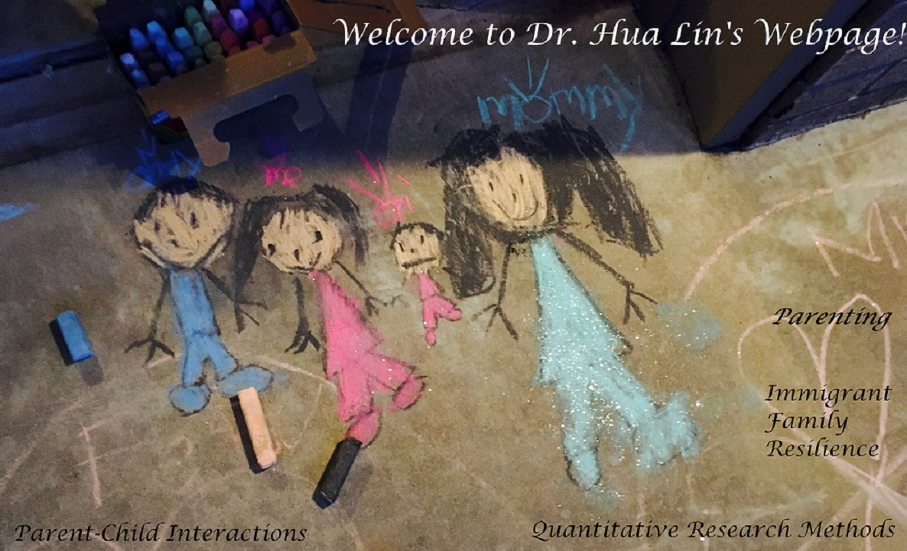

***********

<h1>{{ page.title }}</h1>

> Welcome to **Hua Lin**'s webpage. I am a developmental and family scientist and quantitative research methodologist, serving as a post-doctoral fellow at Oklahoma State University. 

## Research Interests

> One of my research interests is the development of [**parent-child interactions**](/research/###The Development of Parent-child Interactions), in that I focus on momentary parenting goals, parental competency, and social withdrawal. I was certified by Active Parenting in 2015 for teaching “Active parenting 4th edition” and “Parenting Your 1- to 4-Year-Old.”
>
> My research interest in **immigrant family well-being** focuses on how immigrant-related stress impacts adolescent health and behavior and how a psycho-educational intervention can buffer against stress and/or ameliorate the effects of stress in immigrant families from a resilience perspective.
>
> My research interest in **quantitative methods** is enhancing causal evidence from non-randomized longitudinal research designs, cross-cultural psychometric appropriations (including Item Response Theory), and statistic model comparison (mediation moderation, propensity score matching, SEM models, HLM models, Latent class analysis, dual-centered ANCOVA, etc.). 

> I am also applying **statistical software** such as Stata, Mplus, R, SAS, and Python in research and teaching. I have been certified by Data Carpentry to teach data management and statistic programs in Data Carpentry Workshop (e.g., Introduction to R) and Software Workshop (e.g., Python).

> [More...](/research)

## Recent Publications

> - Cox, R. B. Jr., DeSouza, D. K., Bao, J., **Lin, H.**, Sahbaz S., Greder, K. A., Larzelere, R., Washburn, I. J., Leon Cartagena, M., & Arredondo, Lopez, A. (2021). Share Language Erosion: Rethinking Immigrant Family Communication and Impacts on Youth development. Children, 8, 256. doi:10.3390/children8040256
> 
> - **Lin, H.**, & Larzelere, R. E. (2020). Dual-centered ANCOVA: Resolving contradictory results from Lord’s paradox with implications for reducing bias in longitudinal analyses. *Journal of Adolescence*, 85, 135-147. [doi:10.1016/j.adolescence.2020.11.001](https://doi.org/10.1016/j.adolescence.2020.11.001).
>
> - **Lin, H.**, Harrist, A. W., Lansford, J. E., Dodge, K. A., Bates, J. E., & Pettit, G. S. (2020). Adolescent social withdrawal, parental psychological control, and parental monitoring knowledge across seven years: A developmental cascade model. *Journal of Adolescence*, 81, 124-134. [doi:10.1016/j.adolescence.2020.04.007](http:/doi.org/10.1016/j.adolescence.2020.04.007)
>
> - **Lin, H.** (2020). Probing two-way moderation effects: A review of software to easily plot Johnson-Neyman figures. *Structural Equation Modeling: A Multidisciplinary Journal*, 27, 492-502. [doi:10.1080/10705511.2020.1732826](http://doi.org/10.1080/10705511.2020.1732826).
>
> [More Publicaitons...](/publications)

## Recent Presentations
>
### Conference Symposium 
>
#### Regression Toward the Mean, Lord’s Paradox, and Modeling or Forecasting Change in Longitudinal Analyses – SRCD (April 2021)
>
> - **Chair**: Robert Larzelere, Oklahoma State University
> - **Paper 1**: Causal Graphical Analysis of Regression to the Mean - Yongnam Kim, Seoul National University; 
> - **Paper 2**: Dual-Centered ANCOVA Overcomes Bias in ANCOVA with More Statistical Power than Difference-Score Analyses - **Hua Lin** & Robert Larzelere, Oklahoma State University; 
> - **Paper 3**: Estimating School Effectiveness: An Application of Lord’s Paradox - Daniel Wright, University of Nevada at Las Vegas; 
> - **Paper 4**: Design and Analytic Features for Reducing Biases in Skill-Building Intervention Impact Forecasts - Daniela Alvarez-Vargas, Sirui Wan, & Drew Bailey, University of California - Irvine. 
>
### Poster presentations
>
> - Cox, R., **Lin, H.** & Larzelere, R. E., Sahbaz S., Washburn, I. J., Greder, K. (June 2021). Latino Immigrant Family Language Erosion and Youth Alcohol, Tobacco, and Other Drug Use Attitude:Parent-Youth Conflict As a Mediator. Poster will be presented at the Society for Prevention Research 29th Annual Meeting.
>
> - Washburn, I. J., Broadbent, C., Cox, R., **Lin, H.**, & Larzelere, R. E. (June, 2021).Theory Driven Model Selection for Outcomes with Many Zeros: Why Are There so Many Zeros in My Data? Poster will be presented at the Society for Prevention Research 29th Annual Meeting.
>
> - Sahbaz S., Cox, R., **Lin, H.**, Washburn, I. J., & Greder, K. (June, 2021). Promis Pediatric Psychological Stress Measure Is Gender and Acculturation Invariant for Immigrant Latino Youth. Poster will be presented at the Society for Prevention Research 29th Annual Meeting.
>
> - **Lin, H.** & Larzelere, R. E. (April 2021). Using Machine Learning to Identify Key Predictors for Alcohol, Tobacco, and Drug Use in Adolescents. Poster will be presented at the 2021 virtual biennial meeting of the Society for Research in Child Development.
>

[More Presentations...](/publications/#referred-conference-presentations)

***********************
