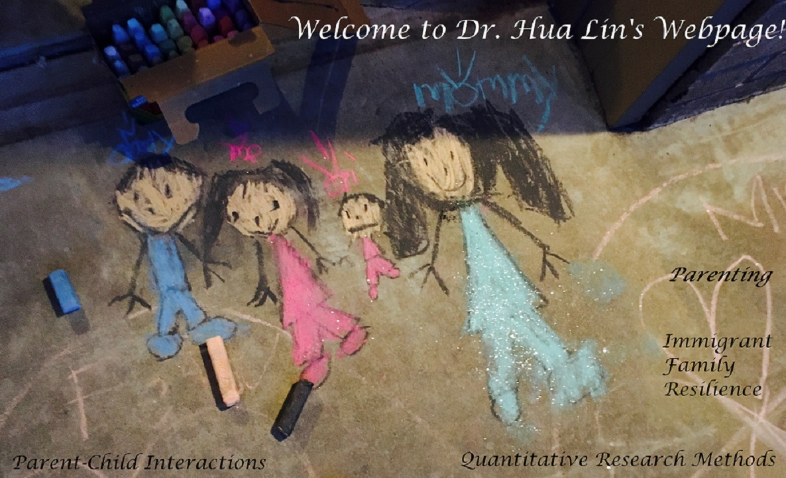

***********

<h2>{{ page.title }}</h2>

> Welcome to **Hua Lin**'s webpage. I am a developmental and family scientist and quantitative research methodologist, serving as a research assistant professor in the [Cennter for Immingrant Health and Eduation](https://education.okstate.edu/research/centers/center-immigrant-health-education/) at Oklahoma State University. 

## Research Interests

> One of my research interests is the development of [**parent-child interactions**](/research/#the-development-of-parent-child-interactions), in that I focus on momentary parenting goals, parental competency, and social withdrawal. I was certified by Active Parenting in 2015 for teaching “Active parenting 4th edition” and “Parenting Your 1- to 4-Year-Old.”
>
> My research interest in [**immigrant family well-being**](/research/#resilience-in-immigrant-families) focuses on how immigrant-related stress impacts adolescent health and behavior and how a psycho-educational intervention can buffer against stress and/or ameliorate the effects of stress in immigrant families from a resilience perspective.
>
> My research interest in [**quantitative methods**](/research/#making-causal-inference-in-longitudinal-analyses) is enhancing causal evidence from non-randomized longitudinal research designs, cross-cultural psychometric appropriations (including Item Response Theory), and statistic model comparison (mediation moderation, propensity score matching, SEM models, MLM models, Latent class analysis, dual-centered ANCOVA, etc.). 
>
> I am also applying [**statistical software**](/research/#data-visualization) such as Stata, Mplus, R, SAS, and Python in research and teaching. I have been certified by Data Carpentry to teach data management and statistic programs in Data Carpentry Workshops (e.g., Introduction to R) and Software [Workshops](/workshops) (e.g., Python) at OSU.
>
> [More...](/research)

## Grants Funded
>
> - *2023*    Oklahoma Tobacco Settlement Endowment Trust Programs G100063367 (2024-2027). Unidos Against Tobacco. $750,000. Cox Jr. (PI), Role: Co-Principal Investigator – FTE = 15%.
>
> - *2023*    National Institute of Child Health and Human Development R15 HD112867-01 (2023-2026). Shared Language Erosion Among Chinese Immigrant Families. $448,800. Principal Investigator – FTE = 21%.
>
> - *2023*    National Institute of Child Health and Human Development R15 HD112895-01 (2023-2026). Randomized Control Trial of the Co-Parenting for Resilience Program. $443,317. Cox Jr. (PI), Role: Co-Principal Investigator – FTE = 15%.
>
> - *2023*    United States Department of Agriculture (2023-2028). Oklahoma State University Sustainable Community Project – The United We Can: Positive Youth Development Program. $640,000. Cox Jr. (PI), Role: Co-I, Project Evaluator – FTE = 15%.
>
> - *2021*   National Institute of Child Health and Human Development R03 HD107307 (2021-2023). Improving Causal Inferences in Child and Family Behavioral Research (ranked in the top 2% of all NIH submissions, awarded in Sep. 2021). $148,600. Co-Principal Investigator – FTE = 33%.
>
> - *2021*    National Institute of Food and Agriculture, 2018-41520-28907 (2021-2026). CYFAR Oklahoma State University and West Virginia University Multi-State Sustainable Community Project The United We Can: Positive Youth Development Program ($1,280,000). Cox Jr. (MPI), Role: Co-I, Project Evaluator – FTE = 20%.
>
***********************
